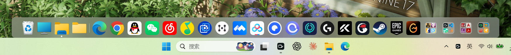

# Dock —— Windows 11 上的 macOS 风格程序坞




一个常驻桌面的 Dock：底部悬浮、毛玻璃、悬停鱼眼放大、点击启动/切换应用、
右键菜单（含以管理员身份运行）、自动隐藏、系统托盘、配置持久化。

> 上面那张是实拍（不是效果图）：Dock 浮在桌面最底层，下面是任务栏 ——
> 两者**零重叠**共存。图标都是真实的程序图标（含大文件夹）。

> **当前状态：P1 完成。** 功能项全部实现，可自动化的验证项全部通过。
> 剩余两项验收需要**会话之外的条件**（真实 8 小时流逝时间 / 人工确认 UAC 弹窗），见文末。

---

## 下载安装（普通用户）

从 **[Releases](https://github.com/EvanLofton/MyDock/releases/latest)** 下载：

| 文件 | 说明 |
|---|---|
| `Dock_x.y.z_x64-setup.exe` | **推荐**：NSIS 安装向导，可自选「仅为我安装」或「为所有用户安装」 |
| `Dock_x.y.z_x64_en-US.msi` | MSI，适合批量部署（装到 `C:\Program Files\Dock`，需要管理员）|

安装向导会依次走：**欢迎 → 许可（MIT）→ 安装类型（仅我/所有用户）→ 安装位置 → 开始菜单 → 安装 → 完成**
（完成页有一个按钮可以**创建桌面快捷方式**）。中文系统上向导是中文的。

- **装到哪**：默认「仅为我安装」→ `%LOCALAPPDATA%\Dock`（**不需要管理员**，也不会弹 UAC）；
  选「所有用户」→ `C:\Program Files\Dock`。
- **依赖**：程序本身是**单个 exe，没有随附 DLL**；唯一的外部依赖是 **WebView2 运行时**
  —— 它由安装向导自动检查，缺了会（联网）下载微软的引导程序静默装好。Win11 自带，无需联网。
- **卸载**：开始菜单/设置→应用里都有 `Dock`，卸载器会删掉程序目录、开始菜单与桌面快捷方式、
  注册表项；**并且会问你要不要一并删除用户数据**（配置 + 日志），勾了就一起清掉。
- ⚠️ 安装包**未做代码签名**：首次运行可能被 SmartScreen 拦（更多信息 → 仍要运行），
  杀软对未签名 Rust 二进制偶有误报，属常见现象。

**日志与配置在哪**（不在安装目录下 —— 安装目录可能是 Program Files，不可写）：

| 内容 | 路径 | 怎么打开 |
|---|---|---|
| 日志 / 崩溃报告 / Minidump | `%LOCALAPPDATA%\dev.local.dock\logs\` | 托盘右键 →「打开日志目录」 |
| 配置 | `%APPDATA%\dev.local.dock\config.json` | 托盘右键 →「打开配置目录」 |

> 出问题先看日志目录里的 `crash-*.txt`；详见[「日志与崩溃取证」](#日志与崩溃取证)。

---

## 从源码运行（开发者）

**前置**：Windows 10/11 x64、[Rust](https://rustup.rs/)（stable）、[Node.js](https://nodejs.org/) 18+。
不需要装 Visual Studio —— Tauri 会把 MSVC 构建工具当依赖自动处理（若报缺 `link.exe`，装一次
「Visual Studio Build Tools + 桌面 C++ 工作负载」即可）。WebView2 运行时 Win11 自带。

```powershell
git clone https://github.com/EvanLofton/MyDock.git
cd MyDock

# ① 前端（生成 app/dist —— tauri.conf.json 的 frontendDist 指向它，缺了后端起不来）
cd app
npm install
npm run build

# ② 后端：开发运行（Dock 会立刻出现在屏幕底部）
cd src-tauri
cargo run
```

想要**可分发版本 / 安装包**（`bundle` 已开）：

```powershell
cd app
npm run build
cd src-tauri
cargo build --release            # → target\release\dock-app.exe，直接就能用
cargo install tauri-cli --version "^2"   # 可选：装了才有安装包
cargo tauri build                # → 生成 .msi / .exe 安装包
```

> **没有控制台窗口**是刻意的（GUI 子系统），所有输出都进日志文件 ——
> 位置和读法见[「日志与崩溃取证」](#日志与崩溃取证)。出错先看那里，不要靠猜。

- **第一次运行会自动探测本机装了哪些常用应用**并预置一屏（系统位置 + 资源管理器 +
  浏览器 + 终端 + 设置）—— 路径与名字全部现查（`App Paths` 注册表 / Shell 显示名 /
  文件版本信息），**代码里没有任何写死的安装路径或应用名**，详见
  [「换台机器能直接用吗」](#换台机器能直接用吗全是现查的)。

- **不自动隐藏**是默认值（Dock 常驻显示）。想让它贴边自动隐藏：托盘菜单或设置页里打开。
  开了之后鼠标移到屏幕**最底边**唤出，离开约 0.4 秒收起。
  实测唤出后 Dock 停在 `900..1020`、任务栏在 `1020..1080`，**零重叠**。
- **Dock 上显示哪些图标、按什么顺序，完全由你决定。** 出厂只是给了几个初值。
  运行状态**不影响位置、也不决定是否出现** —— 没在跑就只是没有白点。
  添加只有两个入口：**从桌面/资源管理器拖进来**、托盘**「添加应用…」**；移除走右键。
- **拖动 Dock 上的图标可以改顺序**，松手即保存（重启后保持）。邻居图标会让位，
  拖到哪儿就在哪儿放开。
- **把图标拖出 Dock（往上拖离面板）再松手 = 从 Dock 移除**。拖出去时面板描一圈红边，
  并在面板顶部显示文字提示「松开即移除『应用名』」——
  **拖回面板内松手则不删**，也不会改顺序。
- **从桌面或资源管理器把程序拖到 Dock 上** → 自动识别身份、去重、**追加到最右侧**；
  如果它**已经在运行**，运行指示点（白点）会立刻亮起来，不用等轮询。
  支持 `.exe`、`.lnk`（含指向商店应用的快捷方式）和 **`.url`（Internet 快捷方式）**；
  文件夹和别的文件会被拒绝并说明原因。
- **Steam / Epic 这类游戏**：在游戏库里右键 → 管理 → **添加桌面快捷方式**，
  然后把桌面上生成的 `.url`（例如 `Wallpaper.url`）**拖到 Dock 上**（或托盘「添加应用…」里选它）。
  图标取的是快捷方式 `IconFile=` 指的那个图标（Steam 指的就是游戏自己的启动器），
  名字取快捷方式的名字 —— **想改名就把桌面那个快捷方式改名**。
  点它 = `ShellExecute` 打开这个 `.url`，也就是走 `steam://rungameid/<appid>` 启动游戏。
  > 直接把 `steam://rungameid/431960` 这样的裸 URL 填进配置也能启动，
  > 但那条路**没有图标**（Shell 对裸协议 URL 不提供图标）、也没有「打开文件所在位置」，
  > 所以推荐走 `.url` 快捷方式。
- **最左侧的「临时文件夹」**：一个**真实目录**（`%LOCALAPPDATA%\dev.local.dock\临时文件`），
  点一下就在资源管理器里打开 —— 拿来放临时文件。它就是个普通条目（能拖、能移出 Dock），
  移出去之后从**托盘 →「添加临时文件夹」**再加回来（会重新放回最左侧）。
  想换个位置就说一声（路径在 `apps::temp_folder_path`，一行的事）。
- **右键文件夹** → 「**重命名…**」（弹输入框，默认是它现在的名字）/「解散文件夹」/「移出 Dock」。
- **右键回收站** → 「**清空回收站**」（红字；**空的时候置灰**）。
  ⚠️ 确认框是 **Windows 自己弹的**（我们刻意不传 `SHERB_NOCONFIRMATION`）——
  这是不可撤销的操作，不该由我们替你决定。清空后图标会立刻变成"空"的那张（见 BL-8）。
- **右键 Dock 上的图标** → 激活 / 最小化 / 关闭 / **从 Dock 移除** / 以管理员身份运行 / 打开文件所在位置。
  右键里还有 **「新建文件夹…」**（会弹输入框让你填名字，见下）、「添加分割线」。
- **大文件夹**：右键 →「新建文件夹…」→ **填名字**（默认「新建文件夹」）→ 原图标原位变成文件夹，
  自己成了里面第一个；把别的图标**拖到文件夹上**就放进去了。点文件夹展开网格，
  里面的图标可以点开、可以右键「移出文件夹」（**最后一个移出后文件夹自动解散**，
  不再留一个点不开的空壳）。
- **右键托盘图标** → 添加应用… / 添加系统位置 / **添加临时文件夹** / **设置…** / 自动隐藏 / 开机自启 / 退出 Dock。
- **设置窗口**（托盘 →「设置…」）是**侧边栏分栏**式，四栏：
  **外观**（实时 Dock 预览 + 色调 + 浓度 + 图标边长 + **面板高度** + 悬停放大）、
  **位置**（屏幕示意图 + 距屏幕底边 + 给任务栏留空）、
  **行为**（自动隐藏 + 收起延迟 + 运行指示点 + **开机自启**）、
  **信息**（只读的运行时状态）。
  改完都**立刻生效**，不需要重启 —— 开着设置页就能看到 Dock 跟着变。

## 开发循环

```powershell
cd app
npm run check:magnify     # 鱼眼放大的纯数学校验（14 项断言）
npm run build             # 类型检查 + 打包到 app/dist

cd src-tauri
cargo build               # ← 必须！Tauri 在**编译期**把 dist 嵌进二进制
```

> **最容易踩的坑**：改完前端只跑 `npm run build` 是**没用的**，
> 必须再 `cargo build` —— 否则应用还在跑旧前端，现象是「改了没反应」。

### 两个可复跑的脚本（别再手搓一次性命令）

| 脚本 | 干什么 | 为什么值得留下 |
|---|---|---|
| `scripts/selftest.ps1` | **验收闸**：构建 selftest 版 → 在**配置副本**上跑全套（焦点矩阵 / 层级 / 拖拽 / 菜单+大文件夹 / 系统位置）→ 报告失败项、核对**真实配置没被改动** → 自动回做产品构建 | 这套流程有五个坑：要用配置副本、`--features selftest` 会**覆盖**产品二进制、**构建前必须先杀掉运行中的 Dock**（否则文件被占用构建失败）、光标要先挪开（否则任务栏弹出来盖住 Dock，所有需要真实输入的检查全挂）、**Dock 必须真的露在桌面上**（它刻意不置顶；而且 2026-09 起层级钩子会拦掉任何把它顶起来的尝试，所以"用 `HWND_TOPMOST` 顶一下再跑"这招失效了 —— 请 `Win+D` 或最小化遮挡窗口） |
| `scripts/soak.ps1` | **长稳采样**：每 120 秒把 Dock 本体 + 它的 WebView2 子进程的内存/句柄/线程/CPU 追加到 `docs/soak-log.txt` | 「连续跑 8 小时不崩」这条验收只能靠真实流逝的时间，采样得有人守着记 |

```powershell
pwsh -File scripts/selftest.ps1        # 退出码 0 = 全过
pwsh -File scripts/soak.ps1 -Once      # 先看看它采出来的是什么
pwsh -File scripts/soak.ps1            # 后台常驻，正常用电脑就行
```

### 环境变量

产品构建可用的：

| 环境变量 | 作用 |
|---|---|
| `DOCK_LOG=error\|warn\|info\|debug\|trace` | 日志级别，默认 `info`。`debug` 才记枚举明细/图标请求这类刷屏细节（等价于老的 `DOCK_DEBUG=1`） |
| `DOCK_LOG_DIR=<dir>` | 重定向日志目录（默认 `%LOCALAPPDATA%\dev.local.dock\logs`；自检时跟着 `DOCK_CONFIG_DIR` 走） |
| `DOCK_CRASH_TEST=panic\|av` | **故意崩一次**，用来验证崩溃取证链路本身（`panic` → panic 钩子；`av` → 访问违例 + Minidump）。只在 debug 构建生效 |
| `DOCK_DEBUG=1` | 兼容老开关：等价于 `DOCK_LOG=debug`（打印窗口枚举明细）。⚠️ **开销明显**，仅排查用，别常开 |
| `DOCK_OPENSETTINGS=1` | 启动就把设置窗口打开并留着（正常走托盘「设置…」）。用于核对设置页的排版观感 |
| `DOCK_CONFIG_DIR=<dir>` | 重定向配置目录（配置只需写要改的字段，其余由 `serde(default)` 补齐） |
| `DOCK_WEBVIEW_DATA=<dir>` | 重定向 WebView2 数据目录（开发用；生产不设，走 `%LOCALAPPDATA%\{identifier}`） |

### 日志与崩溃取证

**Dock 没有控制台**（GUI 子系统，双击启动不会弹终端窗口），所有输出都进文件：

```
%LOCALAPPDATA%\dev.local.dock\logs\
├── dock-2026-09-25.log          当天的日志（按天一个文件；超 8MB 轮转成 .1.log；保留 7 天）
├── crash-20260925-100944.txt    崩溃报告（异常码 / 地址 / 归属模块 + 崩溃前 40 行日志）
└── crash-20260925-100944.dmp    Minidump（VS / WinDbg 直接打开，带完整调用栈；保留最近 20 份）
```

日志长这样（时间 + 级别 + **模块路径** + 内容，`grep` 友好）：

```
2026-09-25 10:11:11.172 INFO  [dock_app::store] [配置] 已加载 C:\Users\…\config.json
2026-09-25 10:11:11.724 INFO  [dock_app::logging] [前端 dock] 页面已加载（/）
2026-09-25 10:11:13.542 INFO  [dock_app::logging] [前端 panel] 页面已加载（/panel.html）
2026-09-25 10:20:31.412 ERROR [dock_app::store] [配置] 新建文件夹失败: …
2026-09-25 10:35:00.001 INFO  [dock_app::logging] [心跳] 已运行 20 分钟，工作集 47 MB
```

**出问题时按这个顺序看**：

1. **先看有没有 `crash-*.txt`**（时间戳对得上就打开它）—— 里面第一屏就写着
   异常码（如 `0xC0000005 ACCESS_VIOLATION`）、出错地址、**落在哪个模块 + 偏移**
   （`dock-app.exe+0x32E2ED` / `nvoglv64.dll+0x1234`），后面贴着**崩溃前的最后 40 行日志**，
   通常一眼就能看出"崩在哪一步"。要更细的栈就打开同名 `.dmp`（VS 里"打开转储文件"即可，
   PDB 就在 `target\debug\` 旁边，符号能直接解析到 Rust 源码行）；
2. **没有 crash 文件但 Dock 没了** = 不是异常而是**被结束**（托盘退出、任务管理器、
   单实例抢占）。日志最后一条**心跳**的时间就是死亡时刻 —— 心跳每 5 分钟一行；
3. **Rust 侧 panic**（`unwrap` 失败等）会在日志里留 `💥 PANIC` + 位置 + 线程 + **符号化回溯**；
   这类不会生成 crash 文件（进程按 Rust 规则退出，退出码 101）；
4. **页面白屏 / 图标不显示**：看 `[前端 …]` 开头的行 —— WebView 是独立进程，
   页面的未捕获异常、`console.error`、React 渲染报错都由前端转发过来（`src/lib/log.ts`）。

验证这套链路本身：`DOCK_CRASH_TEST=panic`（或 `av`）启动一次即可 —— 实测 panic 会留下
`💥 PANIC` + 回溯；`av` 会留下 `crash-*.txt`（本次实测：`0xC0000005`、写地址 `0x0`、
归属 `dock-app.exe+0x32E2ED`）+ 645 KB 的 `.dmp`。

> 自检脚手架（`cargo build --features selftest`）与**全部自检环境变量**——
> 焦点矩阵 / 层级自检 / 拖拽 / 菜单+大文件夹 / 系统位置怎么跑、有哪些坑 ——
> 见 [`docs/verification.md`](docs/verification.md#自检脚手架与全部环境变量)。


## 换台机器能直接用吗（全是现查的）

**这是为开源专门过了一遍的原则：代码里不留"只在我这台机器上成立"的东西。**
早期版本确实有（把 Edge 的安装路径、几个打包应用的 AUMID 和一批中文应用名写死在
`store.rs` 的预置表里），现在全部换成**探测**：

| 原来写死的 | 现在怎么来 | 换机器为什么成立 |
|---|---|---|
| `C:\Program Files (x86)\Microsoft\Edge\…` | 查注册表 **`App Paths`**（HKCU→HKLM、64 位视图→`WOW6432Node` 都查一遍），再验存在性 | 微软安装规范要求所有 GUI 程序登记它，值与安装位置无关；装到 D 盘也找得到 |
| `%WINDIR%\explorer.exe` | `SystemRoot` 环境变量 | 系统盘不一定是 C: |
| 打包应用的 AUMID（本机 `Get-StartApps` 抄的） | **包族名前缀**（`Microsoft.WindowsTerminal_8wekyb3d8bbwe`）+ `target_exists` 现查 | 发布者哈希由发布者决定，所有机器相同；没装就自动跳过 |
| 中文显示名（"终端"/"记事本"/"设置"） | **Shell 显示名**（打包应用）或**文件版本信息**（exe） | 英文系统上自动是 `Windows Explorer` / `Microsoft Edge` |
| —— | `WindowsApps\` 下的路径一律不预置 | 那个目录 ACL 只允许经 AppsFolder 激活，直接启动会被拒绝（等于点不开的图标） |
| 屏幕尺寸 / DPI / 任务栏高度 | `rcWork` + DPI + `ABM_GETTASKBARPOS` 现算 | 分辨率、缩放比、任务栏位置都变了也跟得上 |

**首次运行会预置什么**（本机实测，一台装了 Edge+Chrome+终端的机器）：

```
此电脑 · 回收站 · Windows 资源管理器 │ Microsoft Edge · Google Chrome · 终端 · 设置
```

没装的应用**不会**出现（所以不会留下点不开的空图标）；刻意不预置记事本/计算器/画图那种
小工具 —— 一上来塞 8 个图标会让人第一时间就想删。**已经配置过的用户不受影响**：
预置只在 `config.json` 不存在时跑一次。


---

## 配置参考

配置在 `%APPDATA%\dev.local.dock\config.json`（`DOCK_CONFIG_DIR` 可重定向）。

**改配置文件需要重启；从托盘或设置页改的项立刻生效。**

| 字段 | 默认 | 说明 | 怎么改 |
|---|---|---|---|
| `pinned` | 出厂预置若干 | **Dock 上有哪些图标、按什么顺序** —— 唯一真相。里面也放**分割线**（`{"separator": true}`）、**系统位置**（此电脑 / 回收站）、**大文件夹**（`{"isFolder": true, "children": [...]}`）—— 三者都是"列表里的普通条目"。target 可以是 exe 全路径、`shell:AppsFolder\<AUMID>`、**`.url` 快捷方式路径**（Steam 游戏就是这么放的） | 从桌面拖入 / 托盘「添加应用…」/ 托盘「添加系统位置」/ 右键菜单（新建文件夹 · 加分割线 · 移出 Dock）/ Dock 内拖拽排序 / 把图标拖到文件夹上 |
| `bottomOffset` | `0` | Dock 底边距基准底边多少**逻辑像素**（0 = 贴底） | 设置页 · 位置 |
| `glassRgb` | `[24,24,28]` | 背景色调。同时决定 OS 亚克力染色与前端遮罩 | 设置页 · 外观 |
| `glassAlpha` | `150` | 背景浓度（30–255）。越大越「实」、越看不见模糊 | 设置页 · 外观 |
| `iconSize` | `44` | 图标边长（逻辑像素，32–72） | 设置页 · 外观 |
| `iconGap` | `10` | **图标之间的间距**（逻辑像素，0–30）。这是"方格"间距；视觉间距还会按图形留白做光学补偿 | 设置页 · 外观 |
| `panelHeight` | `72` | **面板高度**（逻辑像素）。窗口高度与它一致；有几何下限（要装得下图标，前端会兜底抬高），上限 200 | 设置页 · 外观 |
| `magnification` | `0.35` | 鱼眼放大增量（上限由面板高度算出，超了会被收敛） | 设置页 · 外观 |
| `autoHide` | `false` | 自动隐藏（贴底唤出） | 设置页 · 行为 **或** 托盘勾选 |
| `hideDelayMs` | `420` | 自动隐藏前鼠标要离开多久（100–2000） | 设置页 · 行为 |
| `showRunningIndicators` | `true` | 是否显示运行白点 | 设置页 · 行为 |
| `reserveTaskbar` | `true` | 给任务栏留空间。**任务栏自动隐藏时也留** —— 问的是 `ABM_GETSTATE` 的「配置」而不是「此刻弹没弹出来」，高度取 `ABM_GETTASKBARPOS` 的吸附矩形（见「已知限制」里那条） | 设置页 · 位置 |
| `launchAtLogin` | `false` | 开机自启 | **只在托盘**（要写注册表，不走 `set_preferences`） |

> **改配置文件需要重启；从设置页或托盘改的项全都立刻生效**（`commands::apply_live` 会重应用
> 亚克力、重算位置，并用 `eval` 通知 Dock 页面重读配置）。自检里逐项验过：
> 背景色、距底部、**图标边长、面板高度**都是即时生效。
>
> **面板变高时窗口往上长、底边不动** —— 否则贴底的 Dock 会长到屏幕外去。自检里同时断言了
> 「高度增加了应有的量」和「底边坐标没变」两点。

> 配置文件里**没有** `discovered` 之类的历史字段 —— 旧版本的两段式模型（固定项 + 自动出现的
> 运行中应用）已废弃，见 `docs/dock-technical-design.md` §4.2「应用顺序模型」。


---


---

## 已知限制（不是 bug，是平台限制或刻意取舍）

> 每条都写清了原因与代价的**完整版**见 [`docs/dock-technical-design.md`](docs/dock-technical-design.md) §13。

| 限制 | 一句话原因 |
|---|---|
| 独占全屏游戏内看不到 Dock | Windows 机制：`TOPMOST` 压不过 D3D 独占全屏 |
| 最大化的窗口会盖住 Dock | **刻意的**：Dock 只属于桌面那一层，其他窗口都该在它之上 |
| 同进程点击 Dock 会夺焦点 | `WM_MOUSEACTIVATE` 落不到深层 Chromium 子窗口；跨进程（真实工况）正常 |
| 外部程序把 Dock 设成「总在最前」 | 已在消息层**于生效之前**拦掉，另有每 5 秒兜底 —— 不会浮在游戏上面 |
| 做不到让任务栏背景完全透明 | Win11 得注入 explorer 改 XAML 画笔，本项目不做（要透明用 TranslucentTB） |
| 无法操作以管理员身份运行的窗口 | UIPI；改为提供「以管理员身份运行」入口 |
| 多显示器 | 只按主屏 `rcWork` 布局，暂不支持 |
| 大文件夹不支持嵌套、也不能把图标拖出文件夹 | 落点语义没有好答案；用右键「解散文件夹 / 移出文件夹」 |
| 文件夹的「移出 Dock」会连里面的一起删 | 文案写明了项数（「移出 Dock（含里面 3 项）」），不做静默的数据损失 |
| 回收站图标不随空 / 满变化 | 图标带缓存；要跟随状态得定期查 `SHQueryRecycleBinW`（见 backlog） |
| 拖拽时图标超出面板会被窗口裁掉 | 窗口只有 72 逻辑像素高；加高窗口会让透明区域吞掉桌面点击 |
| UI 文案只有中文 | 早先「不做 i18n」的决定 |
---

## 文档导航

| 文档 | 内容 |
|---|---|
| [`docs/dock-technical-design.md`](docs/dock-technical-design.md) | **技术设计**：窗口层 / 层级 / 毛玻璃 / 交互 / 动画的取舍与实测依据；§13 是已知限制完整版 |
| [`docs/verification.md`](docs/verification.md) | **验证与性能记录**：每条行为怎么验的、实测数字、自检脚手架、剩余工作、发布前检查清单 |
| [`docs/backlog.md`](docs/backlog.md) | **待办与坑**：已知要改但现在不做的事（含前因后果与实测数字） |
| [`docs/p0-report.md`](docs/p0-report.md) · [`docs/p1-window-layer-findings.md`](docs/p1-window-layer-findings.md) | **阶段报告**：可行性验证、窗口层落地记录 |
| [`docs/soak-log.txt`](docs/soak-log.txt) | 长稳采样原始数据（每 2 分钟一行） |

## 许可证

MIT —— 见 [`LICENSE`](LICENSE)。应用图标与截图都是自己产出（`scripts/make-icon.ps1` /
`scripts/make-social-preview.ps1`），不依赖任何外部素材。
